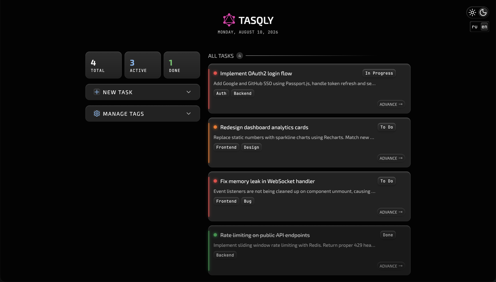
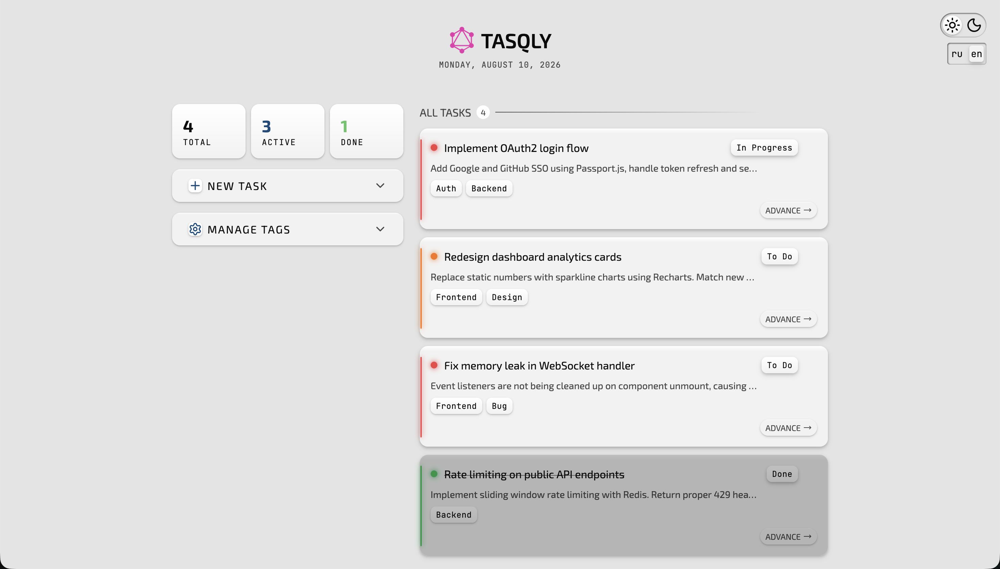
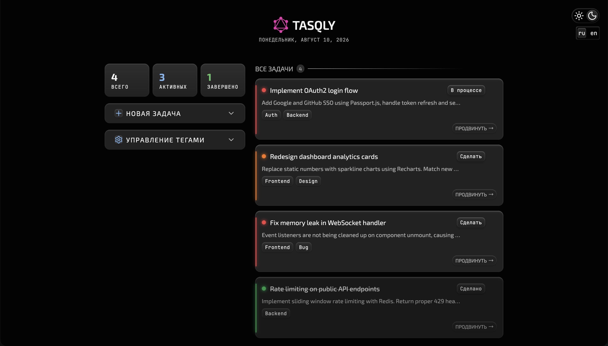
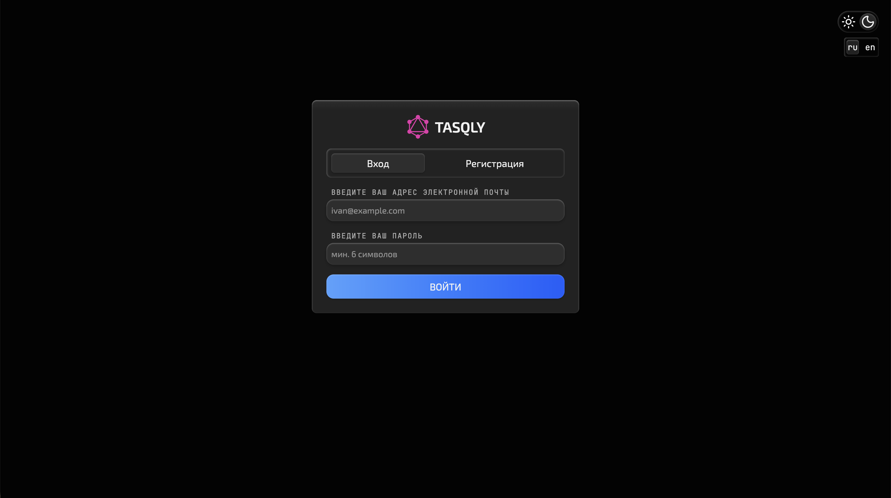
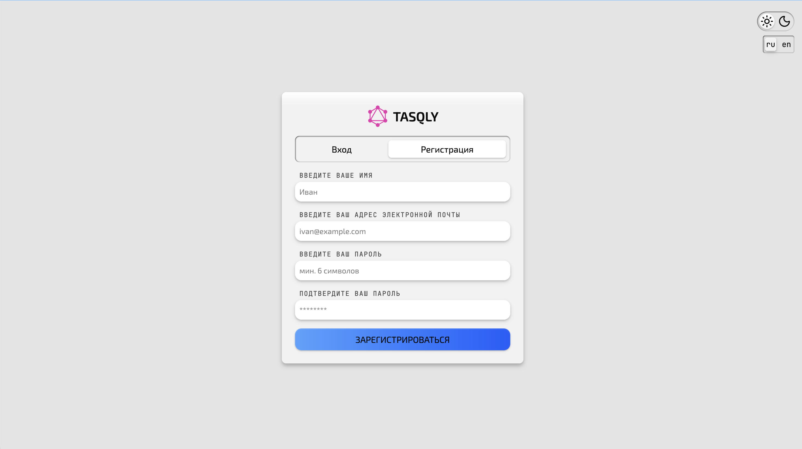
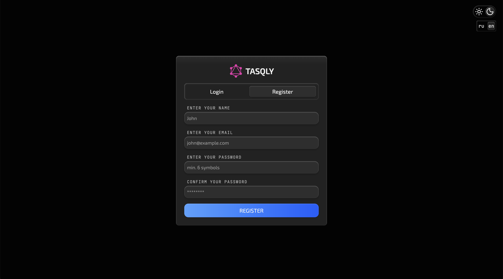
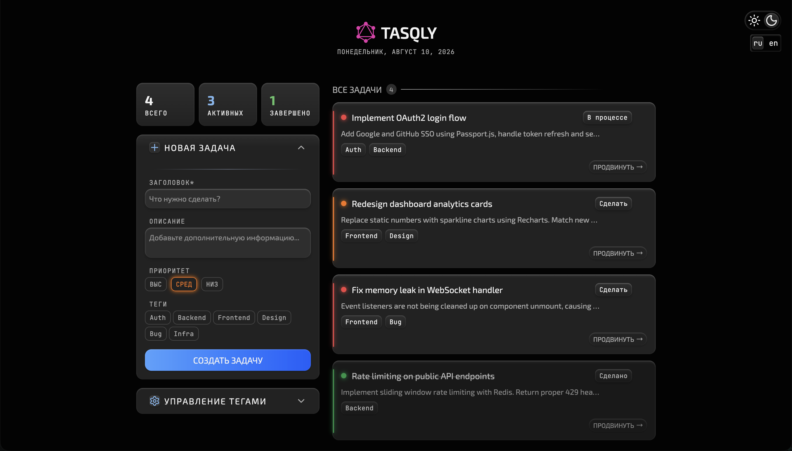
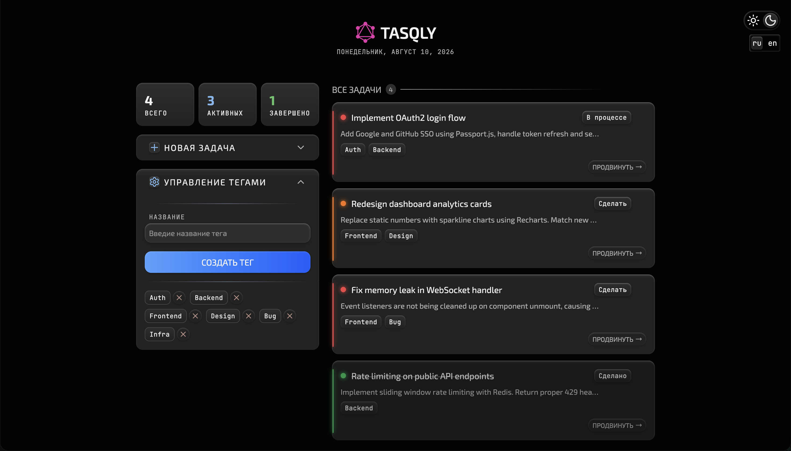

# TasQLy

A pet project for practicing GraphQL, NestJS, Prisma, JWT and Feature-Sliced Design. A simple task tracker with tags, priorities, and statuses.

## Stack

**Backend**
- NestJS
- GraphQL (`@nestjs/graphql`, Apollo Server, Code First approach)
- Prisma ORM
- PostgreSQL

**Frontend**
- React + Vite
- Apollo Client
- Feature-Sliced Design (FSD)
- i18n

**Infrastructure**
- Docker / Docker Compose
- Nginx (serves the frontend, proxies `/graphql` to the backend)

## Gallery


<p align="center">
    Home
</p>


<p align="center">
    Home Light
</p>


<p align="center">
    Home With Russian Locale
</p>


<p align="center">
    Auth
</p>


<p align="center">
    Auth Light
</p>


<p align="center">
    Auth With English Locale
</p>


<p align="center">
    Home With Task Form Expanded
</p>


<p align="center">
    Home With Tag Form Expanded
</p>

## Getting Started

### With Docker Compose (recommended)

```bash
git clone --recurse-submodules https://github.com/Void-Rikk/TasQLy.git
cd TasQLy
docker compose up --build
```

The app will be available at `http://localhost:80`, and the GraphQL API at `http://localhost/graphql` (proxied through Nginx) or directly at `http://localhost:3000/graphql`.

### Local Development

**Backend:**
```bash
cd backend
npm install
npx prisma migrate dev
npm run start:dev
```

**Frontend:**
```bash
cd frontend
npm install
npm run dev
```

## What This Project Was Built to Practice

- Building a GraphQL schema and resolvers in NestJS, including `@ResolveField` for related entities
- Working with Prisma: relations, migrations
- Apollo Client: normalized cache, manual cache updates after mutations (`cache.modify`, `writeFragment`, `evict`)
- Feature-Sliced Design: layer separation, public API of slices, slot/composition pattern for cards with actions
- Docker: multi-stage builds, docker-compose with multiple services, Nginx as a reverse proxy for an SPA
- JWT Auth: access and refresh token